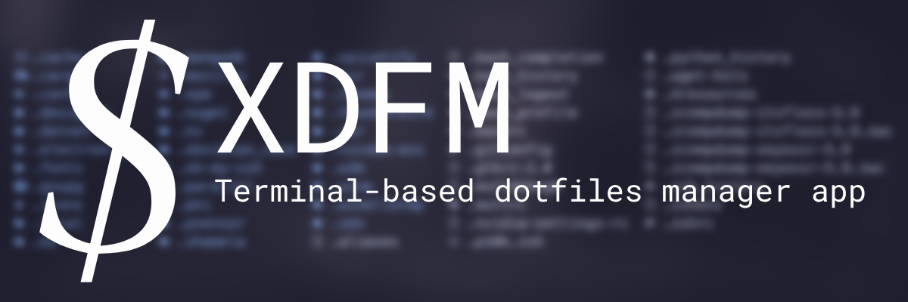

**xDFM (Xeyossr Dotfiles Manager)** is a CLI Dotfiles Management tool for Linux. This way, you can manage your dotfiles and share them on github with a single command. In short, our goal is to reduce 10 lines of code to 1 line.

## Installing

To install **xDFM**, simply use the following command:

```bash
sudo curl -L -o /usr/local/bin/xdfm https://raw.githubusercontent.com/xeyossr/xDFM/refs/heads/main/dist/xdfm
sudo chmod +x /usr/local/bin/xdfm
```

### Compile yourself

First you need to set up the requirements:

```bash
# Debian/Ubuntu-based distributions
sudo apt install python python-pip

# Redhat/CentOS
sudo dnf install python python-pip

# Arch
sudo pacman -S python python-pip
```

Compile with:

```bash
python -m venv myenv
source myenv/bin/activate
pip install -r requirements.txt
pyinstaller --onefile xdfm.py
```

and copy `xdfm` to path (optional):

```bash
chmod +x dist/xdfm
sudo cp dist/xdfm /usr/local/bin
```

## Usage

```
Usage: xdfm.py [OPTIONS] COMMAND [ARGS]...

  xdfm - Xeyossr Dotfiles Manager.

Options:
  --help  Show this message and exit.

Commands:
  add       Add a new dot folder path to the config.
  remove    Remove an existing dot folder path from the config.
  edit      Edit the path of an existing dot folder.
  create    Create dotfiles directory
  recreate  Recreate the dotfiles directory
  github    Commands related to GitHub operations
```

## Contribution

Found a bug? Have a cool feature request? Feel free to open an [issue](https://github.com/xeyossr/xDFM/issues) or a [pull request](https://github.com/xeyossr/xDFM/pulls). We welcome contributions of all kinds—just no pineapple on pizza, please 🙂
